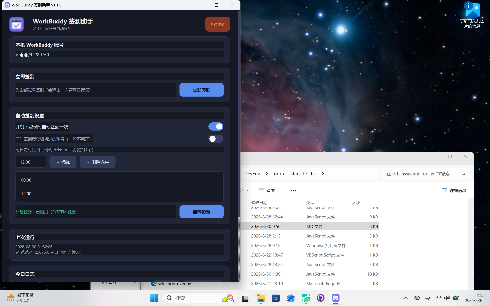

# WorkBuddy 签到助手

> 一键为本机所有 WorkBuddy 账号自动签到，支持开机自启和定时签到。



## 功能

- **多账号签到** — 自动扫描本机所有 Windows 用户的 WorkBuddy 凭据，一次操作为全部账号签到
- **新版加密凭据兼容** — 支持 WorkBuddy 新版 `$wbEncrypted` 加密的凭据文件（AES-256-GCM），自动解密 token，刷新后保持加密形态回写
- **开机自启** — 可设置开机 / 登录时自动签到（通过 Windows 计划任务实现）
- **定时签到** — 支持设置每日多个签到时间点（如 `08:00`、`12:00`、`22:00`）
- **Token 自动刷新** — 签到前自动检查并刷新过期的 accessToken
- **网络等待** — 开机时网络未就绪会自动等待（最长 5 分钟）
- **签到日志** — 按日期记录每次签到的详细结果
- **图形界面** — PySide6 (Qt) 深色主题 GUI，操作简单直观
- **命令行模式** — 支持 `--checkin` 无头签到、`--apply` 注册计划任务、`--scan` 导出账号

## 工作原理

程序通过扫描 `C:\Users\<用户名>\AppData\Local\CodeBuddyExtension\Data\Public\auth\` 目录下的 `workbuddy-desktop.info` 文件获取 WorkBuddy 登录凭据，然后调用 `https://copilot.tencent.com/v2` 的签到 API 完成自动签到。

## 使用方式

### 方式一：直接运行 EXE

双击 `WorkBuddyCheckin.exe` 打开图形界面，点击「立即签到」即可。

### 方式二：命令行

```bash
# 无头签到（适合计划任务）
WorkBuddyCheckin.exe --checkin

# 注册/更新计划任务
WorkBuddyCheckin.exe --apply

# 导出账号列表
WorkBuddyCheckin.exe --scan
```

### 方式三：从源码运行

```bash
pip install PySide6 requests
python workbuddy_checkin.py
```

## 打包为 EXE

```bash
pip install pyinstaller
pyinstaller --noconfirm --onefile --windowed \
  --icon=app.ico \
  --version-file=version.txt \
  --add-data "app.ico;." \
  --name WorkBuddyCheckin \
  workbuddy_checkin.py
```

## 文件说明

| 文件 | 说明 |
|------|------|
| `workbuddy_checkin.py` | 主程序源码（含 GUI 和签到逻辑） |
| `make_icon.py` | 应用图标生成脚本 |
| `app.ico` | 应用图标 |
| `app_icon_256.png` | 256x256 图标 |
| `version.txt` | PyInstaller 版本信息文件 |
| `gui_shot.png` | GUI 截图 |
| `requirements.txt` | Python 依赖 |

## 运行时文件

程序运行时会在 `C:\ProgramData\WorkBuddyCheckin\` 下生成以下文件：

| 文件 | 说明 |
|------|------|
| `config.json` | 用户配置（开机自启、定时时间等） |
| `last-run.json` | 最近一次签到结果 |
| `accounts.json` | 扫描到的账号列表 |
| `setup-result.json` | 计划任务注册结果 |
| `logs/checkin-YYYY-MM-DD.log` | 每日签到日志 |

## 系统要求

- Windows 10 / 11
- 已安装并登录 WorkBuddy 桌面端（新版加密凭据依赖 WorkBuddy.exe 提供解密密钥）
- 管理员权限（首次注册计划任务时需要）

## 版本说明

- **v1.4.1** — 计划任务可靠性修复与旧版清理：任务设置改为「电池模式可运行 / 切电池
  不中断 / 错过的定时点自动补跑」（此前 Windows 默认的电池限制会导致定时点上任务被拒，
  错误码 0x800710E0）；普通用户运行时日志/状态同时镜像到
  `%LOCALAPPDATA%\WorkBuddyCheckin`，GUI 读取两处较新者；合并迁移任务为单一
  `WorkBuddy-AutoCheckin`（每天 00:00/12:00 + 登录补跑）；删除全部旧版
  （PowerShell 版脚本、旧系统任务、旧 exe）。
- **v1.4.0** — UI 全面重做为「清爽浅色」风格：无边框白色卡片 + 柔和投影 + 大留白，
  飞书/Notion 式观感；仪表盘双列布局（签到中心 / 自动签到 / 今日日志），时间点胶囊、
  账号行内联签到结果（按结果着色）；修复容器背景补丁、普通用户下状态文件写入失败
  导致界面显示脏数据的问题（用户级镜像兜底）。

- **v1.2.0** — 修复新版 WorkBuddy 凭据加密（`$wbEncrypted`）导致的 401 / TypeError 签到失败：
  自动定位 WorkBuddy.exe 获取密钥并解密凭据字段，token 刷新后以加密形态回写；
  无法解密时跳过该账号并给出明确错误；修复 GUI 无写权限时保存设置失败、
  `--checkin` 与 `--apply` 结果文件互相干扰等问题。
- **v1.1.0** — PySide6 GUI、多时间点定时签到、开机自启。
- **v1.0.0** — PowerShell 版（已废弃并从本机移除）。

## License

MIT
